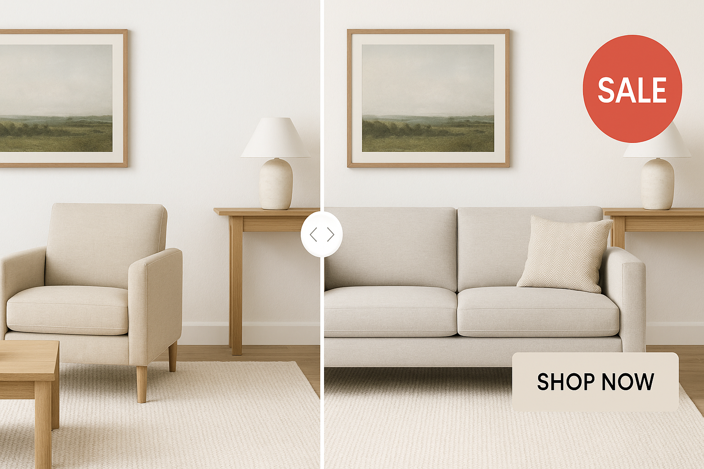

# 🎯 Personalize E-commerce and Marketing Visuals in Next.js with Generative Replace and Overlays

> Personalize visual content for marketing or product displays using:
> - **Generative Replace** to swap scene elements (e.g., “replace the chair with a couch”) using natural language
> - **Image Overlays** to dynamically add call-to-actions, product names, or promo badges



---

### 🧠 What This Demo Shows

In this demo, we personalize visual content for e-commerce and marketing using:

* **Generative Replace**  
  Swap scene elements using natural language prompts — e.g., “replace the chair with a couch.”

* **Image Overlays**  
  Dynamically add call-to-actions, product names, promo badges, or seasonal labels.

These tools enable marketers and designers to instantly customize visuals per audience or campaign using modern frontend technologies.

---

## ✨ Features

* Upload & personalize product visuals with generative AI
* Add branding overlays, promo tags, and seasonal frames
* Leverage generative fill for image resizing & enhancement
* Compare original vs personalized visuals interactively
* Built with modern web tools: **Next.js 15**, **Tailwind CSS 4**, **shadcn/ui**, **Motion.dev**

---

## 🛠 Built With

[](https://nextjs.org/)  
[](https://tailwindcss.com/)  
[](https://motion.dev)  
[](https://ui.shadcn.com/)  
[](./LICENSE)

---

## ✅ Prerequisites

* **Node.js 18+**

```bash
nvm install 20
nvm use 20
````

> Optional: Setup accounts for image hosting (e.g., Cloudinary) or generative APIs.

---

## 🚀 Local Setup

```bash
git clone https://github.com/yourname/personalize-visuals.git
cd personalize-visuals

npm install

cp .env.example .env.local
# → Add your API keys and hosting credentials if needed

npm run dev
# → Visit http://localhost:3000
```

---

## ⚙️ .env Configuration

Create a `.env.local` file with:

| Key                                    | Description                              |
| -------------------------------------- | ---------------------------------------- |
| `NEXT_PUBLIC_API_BASE`                 | Base URL for your backend/generative API |
| `API_SECRET_KEY`                       | Server-side key for protected endpoints  |
| `CLOUDINARY_CLOUD_NAME`                | (Optional) Cloudinary cloud name         |
| `NEXT_PUBLIC_CLOUDINARY_UPLOAD_PRESET` | Upload preset for Cloudinary             |

> ✅ Only expose keys with `NEXT_PUBLIC_` prefix to the browser.

---

## 📜 Available Scripts

| Script          | Description              |
| --------------- | ------------------------ |
| `npm run dev`   | Start the dev server     |
| `npm run build` | Build for production     |
| `npm run lint`  | Run TypeScript & ESLint  |
| `npm run start` | Start in production mode |

---

## 🌍 Deployment

1. Push to GitHub
2. Import into [Vercel](https://vercel.com/)
3. Set required environment variables
4. Click **Deploy**

---

## 🔗 Useful Links

* 🧠 [Cloudinary Layers](https://cloudinary.com/documentation/layers)
* 🤖 [Cloudinary Replace Demo](https://ai.cloudinary.com/demos/replace)
* 🖼️ [Generative Replace Docs](https://cloudinary.com/documentation/generative_ai_transformations#generative_replace)
* ⚛️ [React useOptimistic](https://react.dev/reference/react/useOptimistic)
* 🎨 [Cloudinary Generative Fill](https://cloudinary.com/documentation/generative_ai_transformations)
* 🧰 [shadcn/ui](https://ui.shadcn.com)
* 🎬 [Motion.dev](https://motion.dev)
* ⚡ [Next.js App Router Docs](https://nextjs.org/docs/app)

---

**Turn your static product shots into dynamic marketing visuals. 🚀**
